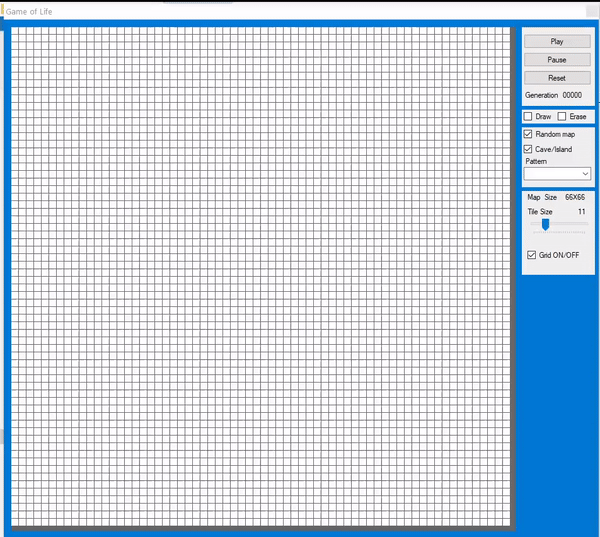

# GameOfLife-Simulation
[Conway's Game of Life](https://en.wikipedia.org/wiki/Conway%27s_Game_of_Life) Simulation made in Visual Studio 2010 and written in C#. 

The Editor has the  following features:
- drawing/erasing of single cells
- choosing from a list of patters (see wiki link)
- generating of a random map and a "island" type map
- changing the map size
- toggling the grid

---
> ## Random map generation
>  
---
> ## "Island Map" generation
>  

